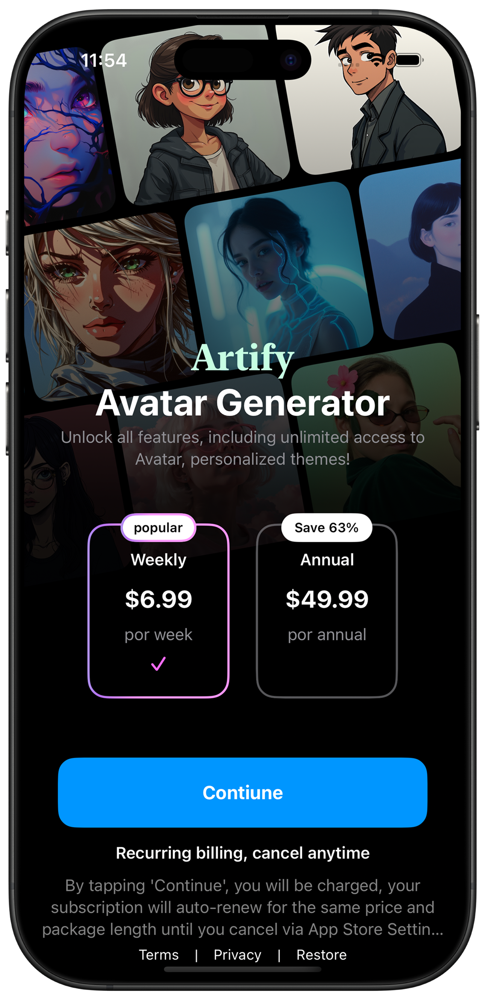

  
  <h1><b>AvatarAiPayWall</b></h1>
  
SpotifyVideoPlayer is a SwiftUI-based music player that replicates the Spotify video playback experience, featuring smooth transitions, interactive controls, and a visually engaging UI. The app integrates a background video player, song lyrics display, artist details, and a merchandise section, providing a rich and immersive music streaming experience. 

## ✨ Features
- **Sleek Design**: Inspired by premium paywall interfaces.
- **Subscription Options**: Weekly and annual plans with easy selection.
- **Animated Carousel**: Smooth scrolling images to enhance the visual appeal.
- **Gradient Background**: Elegant transition effects for better aesthetics.
- **Loading Indicator**: Displays a loading screen when processing purchases.
  
## 🚀 Technologies Used
- **SwiftUI** for a declarative and modern UI.
